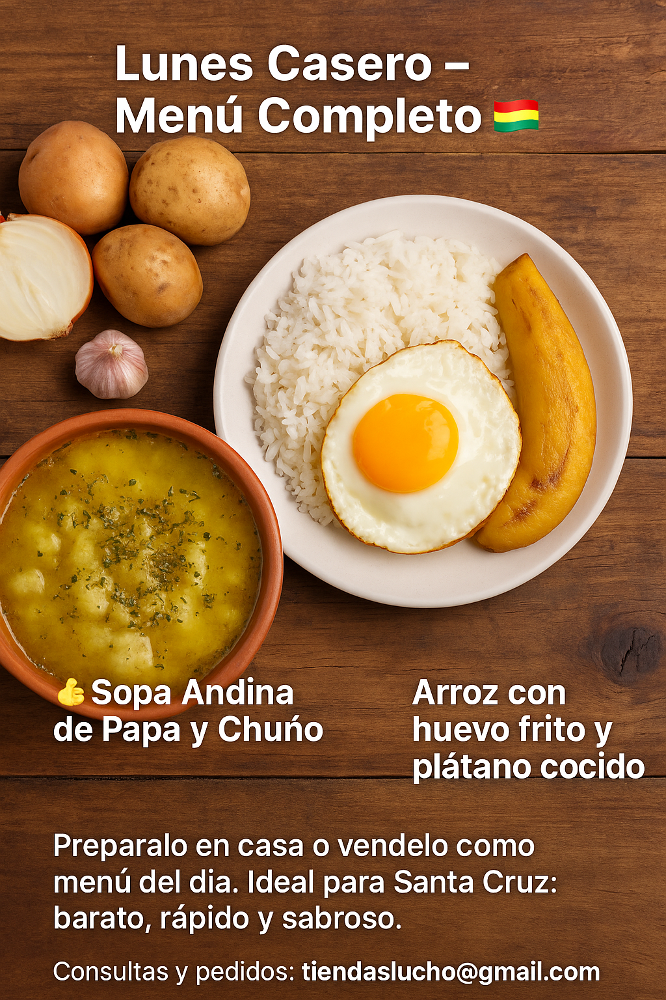

# 📅 **Lunes Casero – Menú Completo** 🇧🇴

🥣 **Sopa Andina de Papa y Chuño**
🍽️ **Segundo: Arroz con huevo frito y plátano cocido**

---

## 🥣 **Sopa Andina de Papa y Chuño**

**Ingredientes para 3 personas:**

* 🥔 Papa: 3 medianas (450g)
* 🧊 Chuño: 1 taza rallado o picado (50g)
* 🧅 Cebolla: ½ unidad (50g)
* 🧄 Ajo: 2 dientes
* 🌿 Orégano seco: 1 cucharadita
* 🧂 Sal al gusto
* 💧 Agua: 1.5 litros
  **Preparación:**

1. Sofreí la cebolla y el ajo picados en una olla.
2. Agregá las papas peladas y cortadas en cubos.
3. Añadí el chuño y el agua.
4. Herví por 25 minutos.
5. Al final, agregá sal y orégano seco. ¡Listo!

---

## 🍽️ **Arroz con huevo frito y plátano cocido**

**Ingredientes para 3 personas:**

* 🍚 Arroz: 1 taza y media (300g crudo)
* 🥚 Huevos: 3 unidades
* 🍌 Plátano de freír: 3 medianos
* 🧂 Sal al gusto
* 🛢️ Aceite para freír

**Preparación:**

1. Cociná el arroz con agua y sal (doble cantidad de agua que arroz).
2. Freí los huevos en aceite bien caliente.
3. Herví o cociná al vapor los plátanos enteros (con cáscara si son maduros).
4. Serví el arroz, colocá el huevo encima y acompañá con el plátano pelado.

---

📍**Preparalo en casa o vendelo como menú del día. Ideal para Santa Cruz: barato, rápido y sabroso.**
📩 Consultas y pedidos: **[tiendaslucho@gmail.com](mailto:tiendaslucho@gmail.com)**

\#MenúDelDía #ComidaBoliviana #SantaCruzBolivia #LunesCasero #CocinaFacil

---

¿Continuamos con el **menú del martes**?  [Ir al Menú del dia Miercoles](./Receta-02Martes.md)
