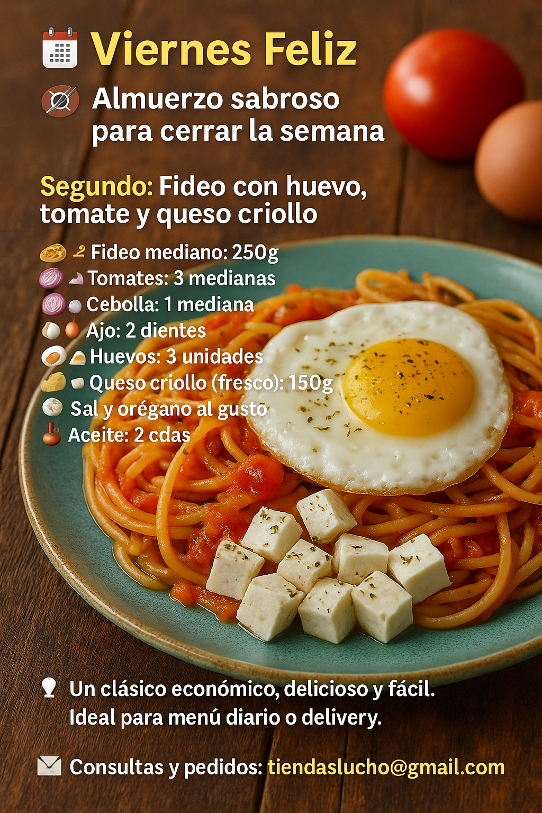

# 📅 **Viernes Feliz – Almuerzo sabroso para cerrar la semana** 🇧🇴

🍽️ **Segundo: Fideo con huevo, tomate y queso criollo**

---

## 🍽️ **Fideo con huevo, tomate y queso criollo**

**Ingredientes para 3 personas:**

* 🍝 Fideo mediano: 250g
* 🍅 Tomates: 3 medianos
* 🧅 Cebolla: 1 mediana
* 🧄 Ajo: 2 dientes
* 🥚 Huevos: 3 unidades
* 🧀 Queso criollo (fresco): 150g
* 🧂 Sal y orégano al gusto
* 🛢️ Aceite: 2 cucharadas

**Preparación:**

1. Cociná el fideo con sal hasta que esté al dente.
2. En sartén, sofreí cebolla, ajo y tomate picado hasta hacer una salsa.
3. Añadí el fideo escurrido y saltealo con la salsa.
4. Serví caliente con un huevo frito encima y cubos de queso criollo.
5. Agregá orégano seco antes de servir.

---

📍**Un clásico económico, delicioso y fácil. Ideal para menú diario o delivery.**
📩 Consultas y pedidos: **[tiendaslucho@gmail.com](mailto:tiendaslucho@gmail.com)**

\#ViernesFeliz #ComidaBoliviana #MenúEconómico #FideoConQueso #SantaCruzCocina

---

¿Continuamos con el **menú del Lunes**?  [Ir al Menú del dia Lunes](./Receta-01Lunes.md)